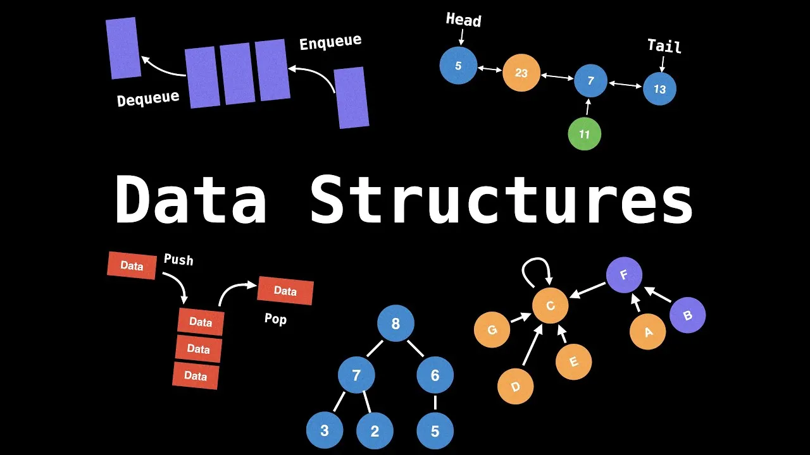

# Data Structures & Sorting Algorithms

## Project Overview
This repository is a practice project where I implement fundamental **data structures** and **sorting algorithms** in **one Python file**.  
The goal is to build a solid foundation in algorithm design, implementation, and complexity analysis.

 

## Implemented Data Structures

### Linear Data Structures
- Array  
- Linked List (Singly, Doubly)  
- Stack  
- Queue  
- Hash Table  

### Non-Linear Data Structures
- Tree (Binary, BST, AVL)  
- Heap (Min-Heap, Max-Heap)  
- Graph (Adjacency List, Adjacency Matrix)  
- Tree

-

## Implemented Sorting Algorithms

### Comparison Sorts
- Bubble Sort  
- Selection Sort  
- Insertion Sort  
- Merge Sort  
- Quick Sort  
- Heap Sort  

### Non-Comparison Sorts
- Counting Sort  
- Radix Sort  
- Bucket Sort  

-

## Getting Started

1. **Clone the repo**
   ```bash
   git clone <your-repo-url>
   cd project-root
